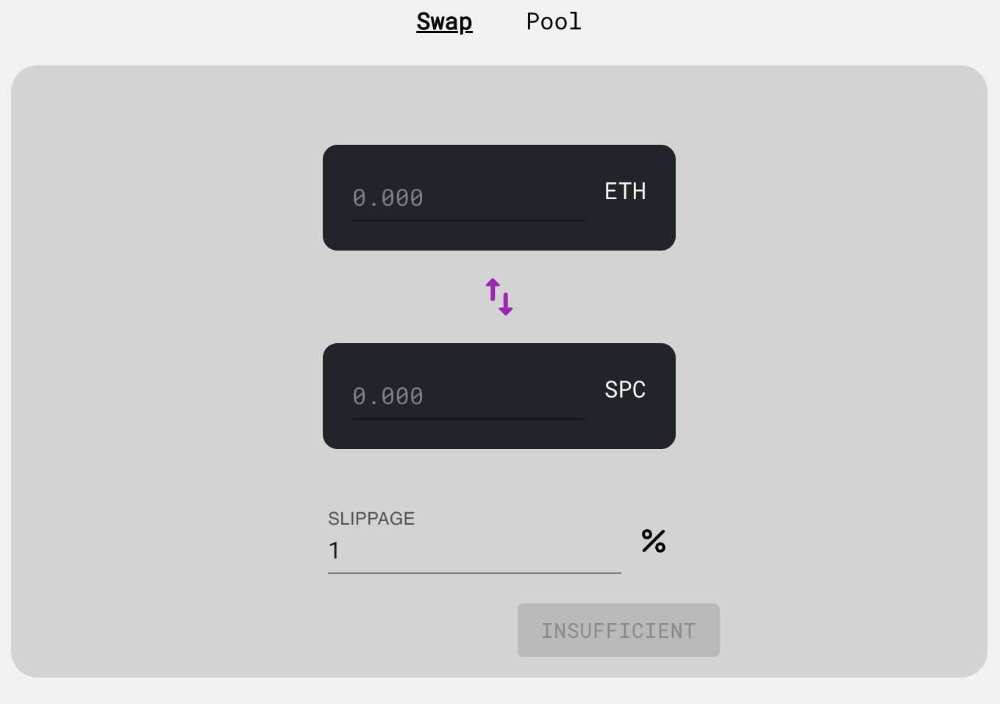
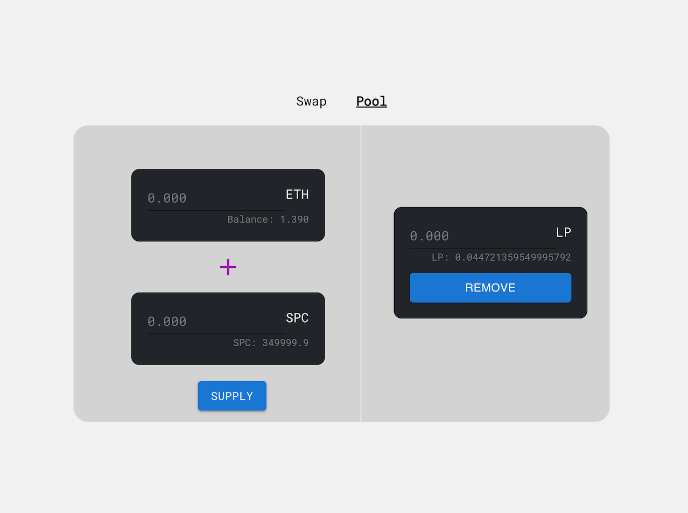

# SpaceCoin <-> ETH Liquidity Pool

## Get Started
- Copy `env.example` to `.env` and set your Mnemonic.
- Run the following:
```
> yarn && yarn test // run tests
> cd space-coin && npm i && npm start // start frontend
```

#shipyard/lp/readme

Deployments:

```
spaceCoin = 0xB432592ef054EBC7f51F02492Ef1E228c8736bA0
spaceCoinLP = 0x9b8cA508f686E395AFBb1c489Bd880880271FC39
spaceRouter = 0x7dce2D748675a0839d4e38A9eB65329c324b2BFE
```

## Space Coin (ERC-20 Token)

DEPLOYED on `Ropsten` Test Network
Contract address: `0x236E36f676cf67B69fabBE23E1AcEE56e40c126B`
[Etherscan link](https://ropsten.etherscan.io/address/0x236E36f676cf67B69fabBE23E1AcEE56e40c126B)

- Total Supply: 500,000

Key features:

- Ability to set ICO (see below) and initiate an ICO.
- Ability to tax on transferring of tokens. Owner has ability to toggle tax on transfers.

### ICO

- ICO initiated on `SpaceCoin` deployment.
- The goal is to raise 30kΞ via different phases.
- Phases:
   - `Seed`: Allows a given set of whitelist users to buy tokens and contribute.  Max contribution = `15_000Ξ`, with a max single contributor limit of `1_500Ξ`.
   - `General`: All users can contribute with a max contribution of `30_000Ξ`, with a max single contributor limit of `1_000Ξ`.
   - `Open`: Open to the public with no single user limits until goal of `30_000Ξ` raised is reached.
- Tokens are available to be claimed once in `Open` phase at a rate of 5 tokens per ETH contributed.

## SpaceCoinLP

#### Liquidity pool contract for ETH<>SPC

- ERC-20 contract holding LP tokens given out to users providing liquidity.
- Mints and burns the proper amount of tokens based on provided liquidity.
- On swaps, `1%` is removed from what is sent to users. LPs tokens value are always proportional to the assets in the pool so the LPs receive the fees.

## SpaceRouter

#### Main interface for the liquidity pool

_Note: All token transfer approvals happen prior to calling functions to the router; otherwise, calls will be reverted_

- Anyone is allowed to Add/Remove liquidity as long as the funds are approved to be transferred.
- Swap SPC to ETH and vice versa. Slippage is configurable which reverts transaction if criteria not met.
- All functions have a deadline associated with them.

---

### Some Design Notes:

- I did not include a minimum liquidity. A whale would have to provide an insane amount of ETH for it to be feasible to lock down the LP for themselves.
- I did not expose the `sync` method to the world as there are more edge cases to worry about if users are able to mess with the reserves. Decided it wasn’t worth it and we’re not dealing with deflationary tokens (i.e SPC).

---

## Front-end

`React` app with `TS`, `wagmi` (for web3) with help from ` Material UI`

To get started:

```
> npm install && npm start
```

Nothing else 👍🏽, all the contract on Ropsten are hardcoded in the `constants` file.

Features:

### Swap

- User can swap ETH - SPC on the UI. As you type in ETH, your SPC amount out updates, and vice versa.
- User can click the swap button in between the two inputs to switch the swap direction.
- User can configure slippage.
- When user attempts to swap more than they have, button gets disabled.
- When user is swapping SPC to ETH, user has to first approve their tokens.



### Pool

- User can check both balances under the corresponding tokens.
- If user hasn’t approved their SPC to the Router, user is required to that first before supplying liquidity (otherwise you risk losing gas).
- If user has no LP, the right half to remove LP is hidden.
- User has ability to remove their LP token, which returns their liquidity back to them.



#### Some caveats with FE:

- Deadlines are all set to a day from today. Feel free to change it in the `constants` file.
- No validation on the inputs to save time.
- Values don’t reset after supplying. Refresh page to see the new LP tokens if you provided any.
- When adding LP, approve button only appears when the allowance is zero for the router; and disappears when it knows it has an allowance. However, in the Swap screen; approve is always there. I just got lazy and its late.
- Once you hit approve and your transaction is pending, I didn’t remove the approve button so you could technically hit it again. Don’t do that 🙃

